# Automatizacion-pruebas-servicios-REST
Estas herramientas muy sencilla pueden ayudarnos a la automatización de pruebas de Web Servicies REST Utilizando la herramienta JMETER 3.1 o 5.0

[TOC]

### Preparación de data

Antes que nada para iniciar la preparacion de datos para las pruebas se debe abrir el documento "Generador.xmls",en el cual se encuentras 2 hojas,condiciones la cual es donde se configurar los parametros y la hoja data,donde se escribira los datos para las pruebas
> Nota: para que no haya inconvenientes a la hora de generar la data la hoja data,siempre debe estar limpia sin datos,preferiblemente eliminar todas las filas que tengan datos o algun style

Una vez abierto el documento en la hoja condiciones nos encontraremos con 2 tablas una para los parametros y otra para los criterion que se explicara que se debe hacer a continuacion:


1. Indice que corresponde al contador de la propiedades `Ejemplo: 1,3,10`
2. Nombre del parametro `Ejemplo: Name,Apellido,Version`
3. Valor de la propiedad que es asignado cuando la peticion es valida `Ejemplo: BBS,es_CO`
4. Valores que puede tomar una propiedad,solo aplica para tipos de dato array cada valor es separado por coma  `Ejemplo: CC,CE,NI,TI`
5. Valor que corresponde al tamaño maximo de la propiedad un numero entero,si no tiene tamaño maximo dejar campo vacio `Ejemplo: 25,45,39` 
6. Valor que corresponden la propiedad de obligatoriedad de un campo si aplica se escribe `X` si no se deja el campo vacio
7.  Valores que corresponde al tipo de dato de la propiedad puede ser: `String,Integet,Number,Boolean,Date-time,Array` 
8.  Valores que corresponde al dato invalido simpre y cuando sea un tipo de dato array y tenga diferentes valores posibles
9.  Valores que corresponden al tipo de propiedad que puede ser: `Header,Body,Query,Path`

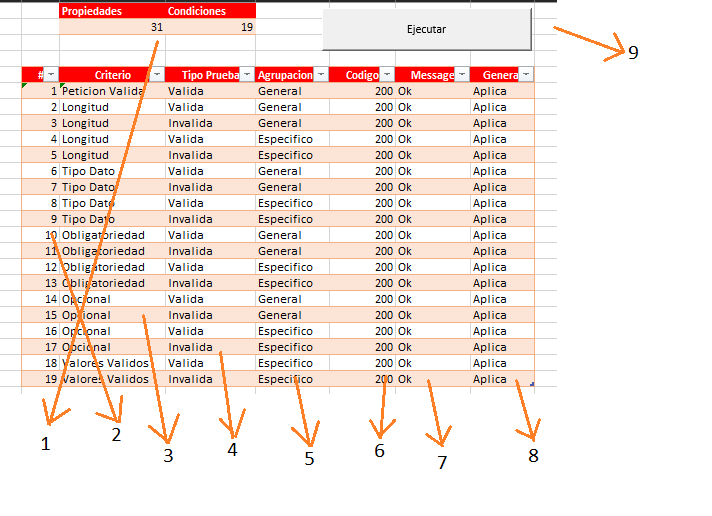

1. Contador de numero de propiedades y numero de criterios a evaluar,toma en cuenta los indeces para realizar esta operacion
2. Indice que corresponde al contador de los criterios `Ejemplo: 1,3,10` 
3. Valor correspondiente al tipo de validacion que desea realizar puede ser: `Peticion valida,Longitud,Tipo de dato,Obligatoriedad,Opcional,Valores validos`
4. Campo corresponde al tipo de pruebas que puede ser: `Valido para caso de prueba positiva o Invalida para caso de prueba negativa`
5. Campo que corresponde al tipo de agrupacion de los parametros que son: `General para que verifique todos los campos juntos o Especifico para que verifique un campo a la vez`
6. Corresponde al codigo que se espera con ese criterio en la respuesta del servicio
7. Corresponde al mensaje que se espera con el criterio que se evalua
8. Corresponde a la opcion si se desea generar la data para ese criterio puede ser: `Aplica o No Aplica`
9. Corresponde al boton que una vez realizado todos los pasos anteriores,se genera la correspondiente data para las pruebas

Una vez el archivo termina de ejecutarse tendremos algo similar en la hoja data del libro como lo siguiente:

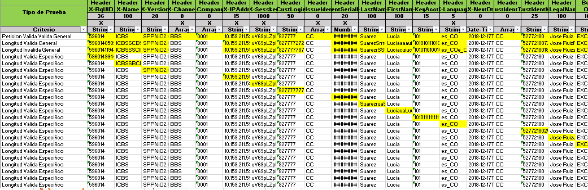


### Instalacion de herramientas

#### Jmeter

1.  Descargar la herramienta JMeter version 3.1 o 5, [Dowload](https://archive.apache.org/dist/jmeter/binaries/)
2.  Descargar la herramienta tika-app.jar, [Dowload](https://www-us.apache.org/dist/tika/)
3.  Una vez descargado las herramienta en la carpeta origen del jmeter mover el archivo `tika-app.jar` en la ruta `Jmeter/lib/`
4.  Ejecutar el archivo `Jmeter/bin/ApacheJMeter.jar`

### Preparacion de script

#### Preparando datos

1. Abrimos el documento "data.xlsx",el cual tendra 2 hojas una llamada parametros y otra data
2. Accedemos a la hoja parametros que tiene lo siguiente:
3. 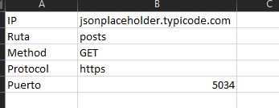
4. Escribimos las correspondientes propiedades que necesita el servicio para realizar la peticion
5. Acedemos a la hoja data,en la cual debemos copiar o escribir en la fila numero 1 el tipo de parametro y en la fila numero 2 escribimos el nombre del parametro los tipos de parametros pueden se los siguientes: `Header,Body,Path,Query,Code o Message`,como se muestra a continuacion:
6. 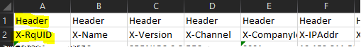
7. Lo siguientes es copiar los respectivos datos por fila de cada uno de los parametro que genero la herramienta "generador.xmls",como se muestra a continuacion:
8. 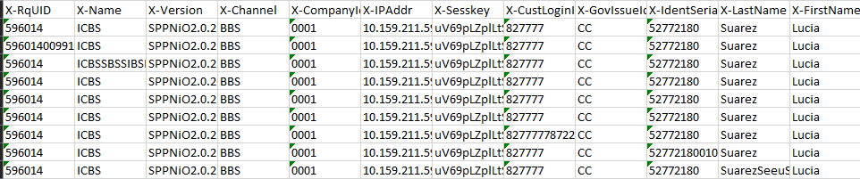
9. Para finalizar revisamos la ultima columna la cual debe tener en la primera fila el valor de Message y los correspondientes datos,como se muestra a continuacion:
10. 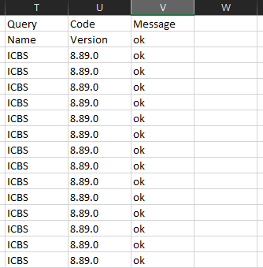
11. Por ultimo guardamos el documento.

#### Configurando script

1. Una vez abierto el Jmeter,procedemos abrir el proyecto Generic v3.jmx o Generic v5.jmx,correspondiente a la version del jmeter
2. accedemos al componente Plan de pruebas,que esta ubicado en el menu que esta parte izquierda de JMeter,una vez hay vamos a la parte inferior donde dice "Añadir directorio o jar al classpath",damos click en el boton Navegar,buscamos el documento `JmeterExcel.jar`,una vez selecionado debe verse de la siguiente manera: 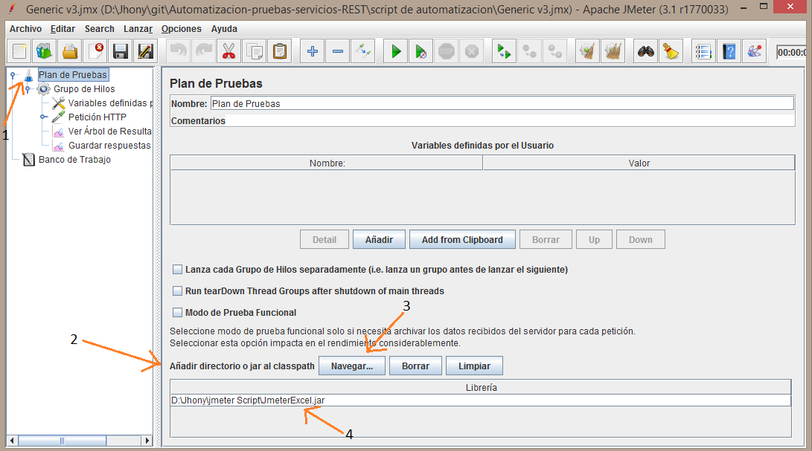
3. Lo siguiente es acceder al componente Grupo de hilos,en la opcion que dice "contador del bucle",pones el numero de filas que tiene el documento "data.xlsx", en la hoja de data y le restamos 2 `Ejemplo: Hay un total de 50 filas en el documento,en la opcion de contador bucles ponemos 48`,Debe ser similar a lo siguiente: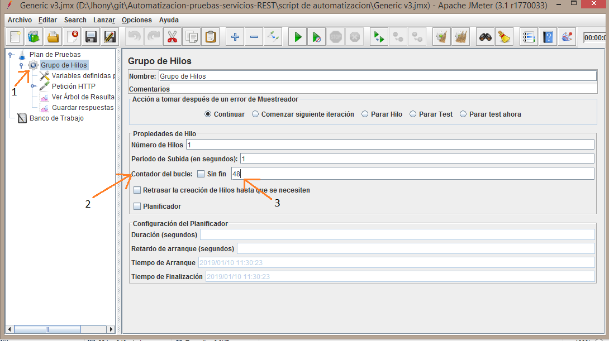
4. Lo siguiente es acceder a las "variables definidas",configurar la varible data con la ruta absoluta del documento "data.xlsx" `Ejemplo de una ruta absoluta "D:\\Jhony\\jmeter Script\\data.xlsx"`,debe verse similar a lo siguiente: 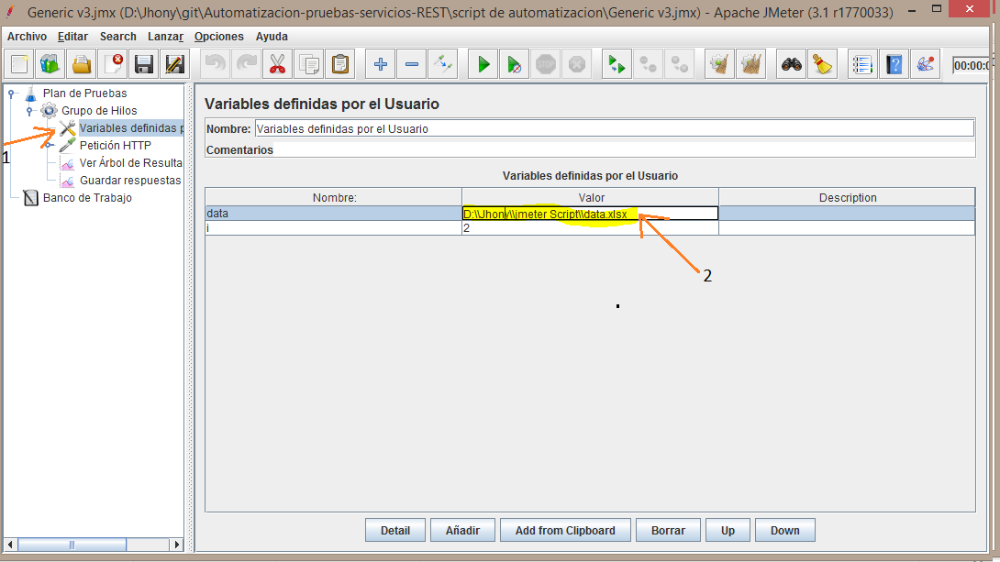
5. por ultimo accedemos a arbol de resultado,corremos el script y vemos los correspondientes resultados de la prueba,como se muestra a continuacion: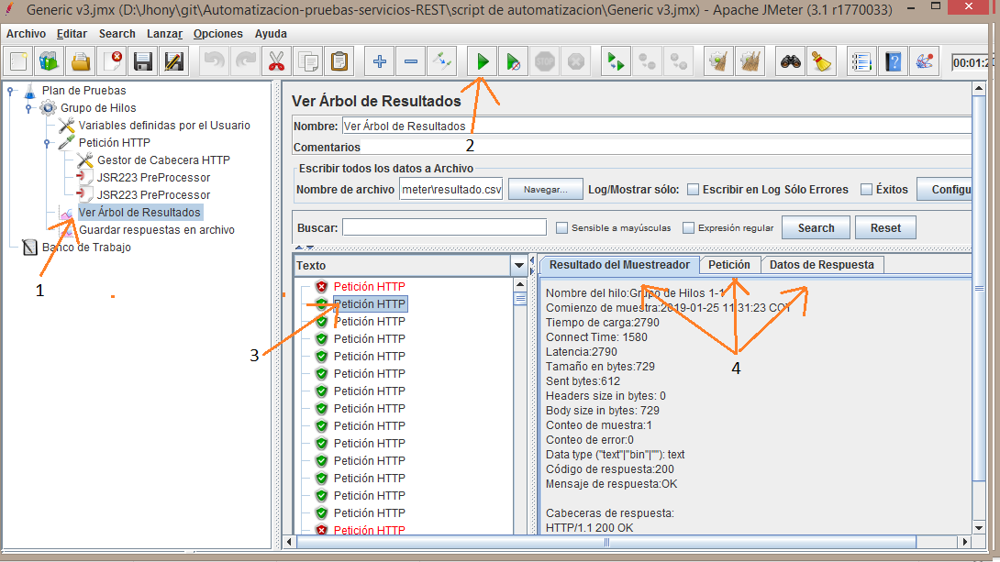

#### Configurando archivo csv
1. Para configurar un archivo de datos csv,en el componente arbol de resultados,en la opcion navegar damos click,selecionamos una ruta del disco y llamamos el archivo `resultados.csv`,como se muestra a continuacion: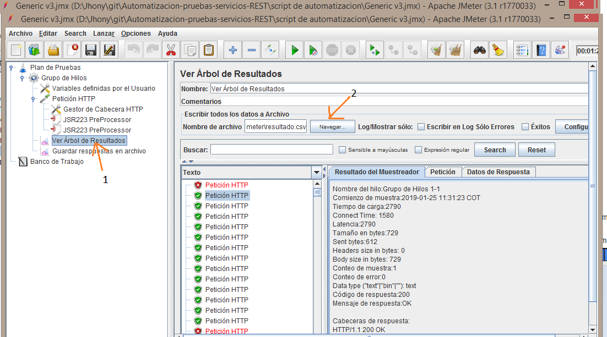
> Nota: si desea cambiar el nombre del archivo csv,debe poner el mismo nombre que puso en el archivo en el componente guardar datos de respuesta en la opcion que dice `prefijo de nombre de archivo`

### Documentacion Generados

```
ToJsonArray(Range header;Range body)
```
> Metodo que con 2 parametros construye el json de la peticion,recibe el parametro header que corresponde a un rango de celdas con los valores de la Keys,tambien recibe un 2 parametro con los valores que corresponde a los values `Ejemplo =ToJsonArray(A1:D1;A3:D3)`

> Nota:Deben tomar en cuenta el tipo de celda para la construcion del json,debido a que el algoritmo interpreta los tipo de dato que tiene la celda para la costruccion del json,ademas si el algoritmo llega a encontra celdas del keys con el mismo nombre de la propiedad los construye como un Array con los distintos valores del segundo argumento
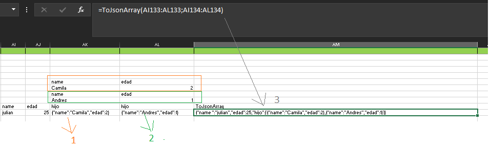

### Documentacion Api JmeterExcel.jar

#### Class Work

###### Constructor

```
new Work(String ruta)
```
> Constructor de clase que recibe la ruta del archivo de datos el pathAbsolute,para instacias las sheet y leer los datos

###### Metodos

```
SheetWork getSheetParametros()
```
> Metodo que retorna un SheetWork,correspondiente a la hoja de parametros

```
SheetWork getSheetDatos()
```
> Metodo que retorna un SheetWork,correspondiente a la hoja de data

```
void close()
```
> Metodo encargado de cerrar el documento de datos

#### Class SheetWork

###### Metodos

```
ArrayList<Parametro> getListPropiedades()
```
> Metodo que retorna una lista de parametros correspondiente a los parametros en la sheet parametros, solo aplica con esta sheetParametro

```
ArrayList<Parametro> getListParametrosHeader(int row)
```
> Metodo que retorna una lista de parametros correspondientes a los tipo parametro header de la fila determinada,solo aplica para sheetData

```
ArrayList<Parametro> getListParametrosBody(int row)
```
> Metodo que retorna una lista de parametros correspondientes a los tipo parametro body de la fila determinada,solo aplica para sheetData

```
ArrayList<Parametro> getListParametrosPath(int row)
```
> Metodo que retorna una lista de parametros correspondientes a los tipo parametro path de la fila determinada,solo aplica para sheetData

```
ArrayList<Parametro> getListParametrosQuery(int row)
```
> Metodo que retorna una lista de parametros correspondientes a los tipo parametro query de la fila determinada,solo aplica para sheetData

```
public ArrayList<Parametro> getListParametrosCode(int row)
```
> Metodo que retorna una lista de parametros correspondientes a los tipo parametro code de la fila determinada,solo aplica para sheetData

```
ArrayList<Parametro> getListParametrosMessage(int row)
```
> Metodo que retorna una lista de parametros correspondientes a los tipo parametro message de la fila determinada,solo aplica para sheetData

#### Class Parametro

###### Constructor

```
new Parametro(String name, String value) 
```
> Constructor de clase recibe nombre propiedad y correspondiente valor


###### Metodos

```
String getValue()
```
> Metodo que retorna una cadena de caracteres con eñ valor de la propiedad

```
long getValueNumber()
```
> Metodo que retorna un valor entero correspondiente a la propiedad solo aplica para propiedades tipo integer o number

```
String getTipoDato()
```

> Metodo que retorna una cadena de caracteres con el tipo de dato correspondiente a la propiedad que puede ser: String,Date-time,Integer,Number,Boolean o Array

```
String getTipoParametro()
```
> Metodo que retorna una cadena de caracteres con el tipo de parametro correspondiente a la propiedad que puede ser: Header,Body,Path o Query

```
String getName()
```
> Metodo que retorna una cadena de caracteres con el nombre de la propiedad