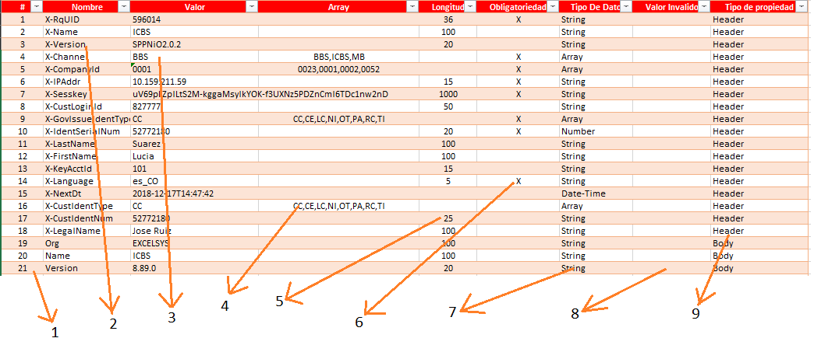

# Automatizacion-pruebas-servicios-REST
Estas herramientas muy sencilla pueden ayudarnos a la automatización de pruebas de Web Servicies REST Utilizando la herramienta JMETER 3 o 5

[TOC]

### Preparación de data



1. Indice que corresponde al contador de la propiedades `Ejemplo: 1,3,10`
2. Nombre del parametro `Ejemplo: Name,Apellido,Version`
3. Valor de la propiedad que es asignado cuando la peticion es valida
4. Valores que puede tomar una propiedad,solo aplica para tipos de dato array cada valor es separado por coma  `Ejemplo: CC,CE,NI,TI`


### Instalacion de herramientas

#### Jmeter

1.  Descargar la herramienta JMeter version 3.1 o 5, [Dowload](https://archive.apache.org/dist/jmeter/binaries/)
2.  Descargar la herramienta tika-app.jar, [Dowload](https://www-us.apache.org/dist/tika/)
3.  Una vez descargado las herramienta en la carpeta origen del jmeter mover el archivo `tika-app.jar` en la ruta `Jmeter/lib/`
4.  Ejecutar el archivo `Jmeter/bin/ApacheJMeter.jar`


### Documentacion Api JmeterExcel.jar

#### Class Work

###### Constructor

###### Metodos

#### Class SheetWork

###### Metodos

```
ArrayList<Parametro> getListPropiedades()
```
> Metodo que retorna una lista de parametros correspondiente a los parametros en la sheet parametros, solo aplica con esta sheet 

```
ArrayList<Parametro> getListParametrosHeader(int row)
```
> Metodo que retorna una lista de parametros correspondiente a las parametros solo a la sheet parametros solo aplioca con esta sheet

```
ArrayList<Parametro> getListParametrosBody(int row)
```
> Metodo que retorna una lista de parametros correspondiente a las parametros solo a la sheet parametros solo aplioca con esta sheet

```
ArrayList<Parametro> getListParametrosPath(int row)
```
> Metodo que retorna una lista de propiedade correspondiente a las parametros solo a la sheet parametros solo aplioca con esta sheet

```
ArrayList<Parametro> getListParametrosQuery(int row)
```
> Metodo que retorna una lista de parametros correspondiente a las parametros solo a la sheet parametros solo aplioca con esta sheet

```
public ArrayList<Parametro> getListParametrosCode(int row)
```
> Metodo que retorna una lista de parametros correspondiente a las parametros solo a la sheet parametros solo aplioca con esta sheet

```
ArrayList<Parametro> getListParametrosMessage(int row)
```
> Metodo que retorna una lista de parametros correspondiente a las parametros solo a la sheet parametros solo aplioca con esta sheet

#### Class Parametro

###### Constructor

```
new Parametro(String name, String value) 
```
> Constructor de clase recibe nombre propiedad y correspondiente valor


###### Metodos

```
String getValue()
```
> Metodo que retorna una cadena de caracteres con eñ valor de la propiedad

```
long getValueNumber()
```
> Metodo que retorna un valor entero correspondiente a la propiedad solo aplica para propiedades tipo integer o number

```
String getTipoDato()
```

> Metodo que retorna una cadena de caracteres con el tipo de dato correspondiente a la propiedad que puede ser: String,Date-time,Integer,Number,Boolean o Array

```
String getTipoParametro()
```
> Metodo que retorna una cadena de caracteres con el tipo de parametro correspondiente a la propiedad que puede ser: Header,Body,Path o Query

```
String getName()
```
> Metodo que retorna una cadena de caracteres con el nombre de la propiedad
